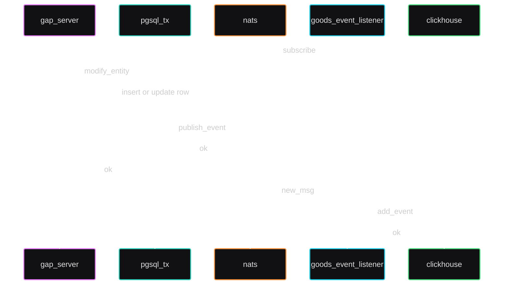

# goods-and-projects
Выполнение очередного тестового задания

sequenceDiagram

```mermaid
---
config:
  look: classic
  theme: redux-dark-color
---
sequenceDiagram
    participant P4 as gap_server
    participant P5 as pgsql_tx
    participant P1 as nats
    participant P2 as goods_event_listener
    participant P3 as clickhouse
    P2 ->> P1: subscribe
    P4 ->> P5: modify_entity
    P5 ->> P5: insert or update row
    P5 ->> P1: publish_event
    P1 -->> P5: ok
    P5 -->> P4: ok
    P1 -->> P2: new_msg
    P2 ->> P3: add_event
    P3 -->> P2: ok

```