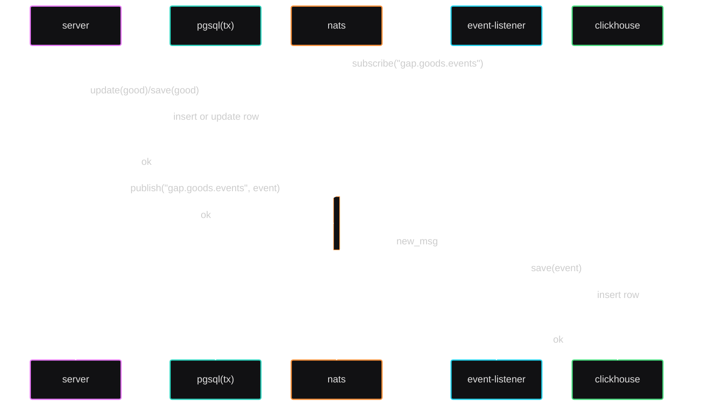

# goods-and-projects

— Что в переводе звучит как — «Товары и компании», а в сокращении — «gap».

В названии присутствует слово «Товары», потому
что только для этого типа сущностей описан http-crud-api _(см. пункт [docker](#docker-запуск-проекта))_.
В названии присутствует слово «Компании» потому, что это второй и последний бизнесовый тип сущности, который есть в проекте.
«»

### Docker. Запуск проекта

_(в системе требуются установленные приложения **docker** и **docker compose**)_

Обязательно создать докер-сеть. Требуется, потому что все сервисы находятся в докер-сети называемой **gap.network**
```shell
docker network create gap.network
```

И теперь можно запускать проект
```shell
make compose-up
```
В результате будут запущены контейнеры:
- **gap.server** — это то самое http-crud-api для товаров. По дефолту будет доступно на https://localhost:8080/. Точка входа находится в **cmd/goods-and-projects** 
- **gap.event-listener** — сервис подписывается на канал *(subject в nats)*, в который должны приходить новые версии состояний товаров. Точка входа находится в **cmd/goods-event-listener**
- **gap.redis** — используется server'ом как «Cache Aside (Lazy Loading)» внутри реализации «репозитория» товаров.
- **gap.pgsql** — посредствам СУБД PostgreSQL реализован «репозитория» товаров.
- **gap.nats** — используется server'ом как асинхронный канал для отправки логов об обновлении состояния товаров.
- **gap.clickhouse** — используется event-listener'ом как хранилище логов.

docker-compose скрипты лежат в директории **./docker**, в корне этой директории есть docker-compose файл, 
который запускает вышеописанные сервисы, а рядом директории со вспомогательными файлами для этих сервисов (миграции для бд).

В той же директории есть сервис **adminer**, расположен по пути **docker/adminer/docker-compose.yaml** — это web-ui для pgsql, подробнее [тут](https://hub.docker.com/_/adminer/).

### Как это должно работать «на бумаге» 

Диаграмма последовательностей, демонстрирующая взаимодействий сервисов, при добавлении или обновлении товаров (goods) 


### Как протестировать

Убедиться в корректности логики, можно, лишь выполнив ручное тестирование.

Для этого:
- Запустить docker-compose сервисы (**make compose-up**).
- Отправлять http/rest запросы на baseUrl http://localhost:8080/. 
Поддерживаемые запросы можно посмотреть в файле **server-requests.http** (IDEA http client) 
либо в объявлении обработчиков (**internal/controller/http2/register_handler**).
- _*если запущен сервис **docker/adminer**_, то наблюдать состояние БД pgsql в web-ui по адресу http://localhost:8085/
- Наблюдать историю обновления товаров в clickhouse.


### А что дальше?

Приоритет поставил такой: работающий-некорректный лучше, чем частично-работающий-корректный проект, поэтому:

**П1** В проекте не хватает тестов, их нет ни на бизнес-логику, ни на адаптеры, их вообще нет.

Структура программы много раз менялась, много корректировок имен переменных и функций, много переработок кода, что стало причиной:

**П2** Очень малый процент комментариев кода, будущем ревьюирам будет тяжко, но я постараюсь к началу ревью постараюсь восполнить пробелы. 
