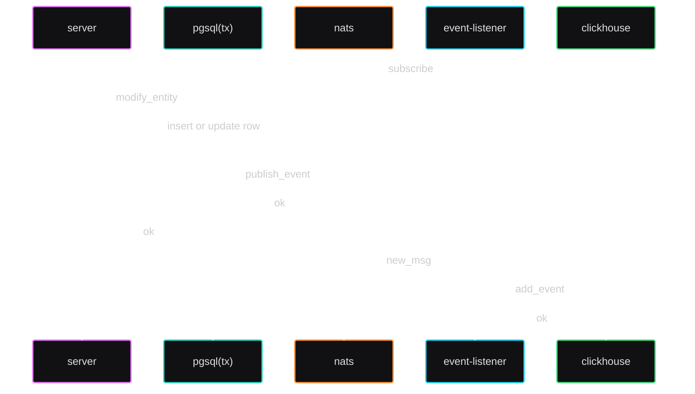

# goods-and-projects

— Что в переводе звучит как — «Товары и компании», а в сокращении — «gap».

В названии присутствует слово «Товары», потому
что только для этого типа сущностей описан http-crud-api _(см. пункт [docker](#docker-запуск-проекта))_.
В названии присутствует слово «Компании» потому, что это второй и последний бизнесовый тип сущности, который есть в проекте.
«»

### Docker. Запуск проекта

_(в системе требуются установленные приложения **docker** и **docker compose**)_

Обязательно создать докер-сеть. Требуется, потому что все сервисы находятся в докер-сети называемой **gap.network**
```shell
docker network create gap.network
```

И теперь можно запускать проект
```shell
make compose-up
```
В результате будут запущены сервисы:
- **gap.server** — это то самое http-crud-api для товаров. По дефолту будет доступно на https://localhost:8080/. Точка входа находится в **cmd/goods-and-projects** 
- **gap.event-listener** — сервис подписывается на канал *(subject в nats)*, в который должны приходить новые версии состояний товаров. Точка входа находится в **cmd/goods-event-listener**
- **gap.redis** — используется server'ом как «Cache Aside (Lazy Loading)» внутри реализации «репозитория» товаров.
- **gap.pgsql** — посредствам СУБД PostgreSQL реализован «репозитория» товаров.
- **gap.nats** — используется server'ом как асинхронный канал для отправки логов об обновлении состояния товаров.
- **gap.clickhouse** — используется event-listener'ом как хранилище логов.


### Как это должно работать «на бумаге» 

Диаграмма последовательностей, демонстрирующая взаимодействий сервисов, при добавлении или обновлении товаров (goods) 


### А что дальше?

В проекте не хватает тестов, их нет ни на бизнес-логику, ни на адаптеры, их вообще нет.

Приоритет поставил такой: работающий-некорректный лучше, чем частично-работающий-корректный проект. 