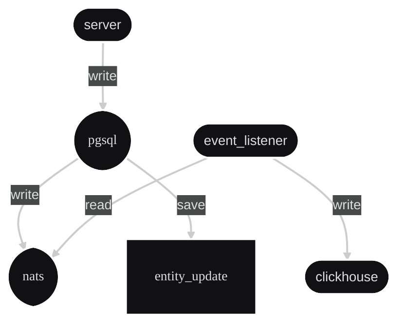
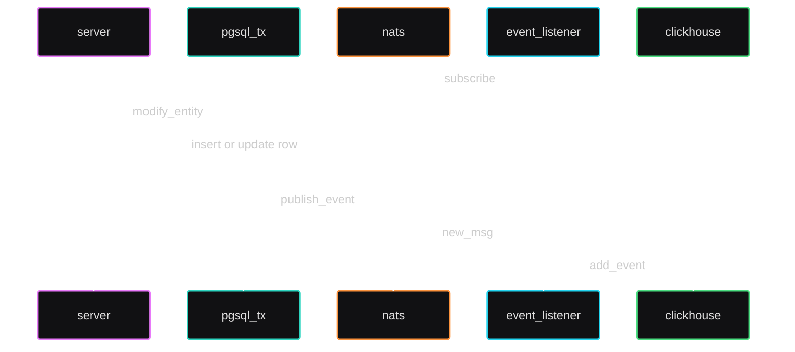

# goods-and-projects
Выполнение очередного тестового задания

[server] (write)> [pgsql] +entity_update
               \(write)> [nats] <(read) [event_listener] (write)> [clickhouse]

flowchart

sequenceDiagram
